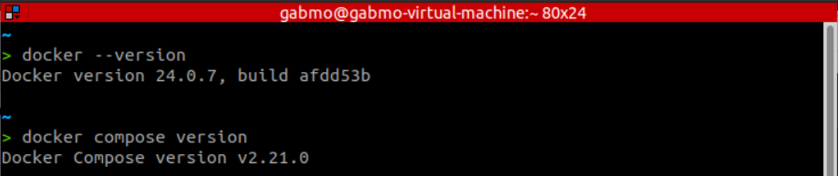
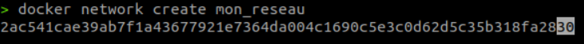
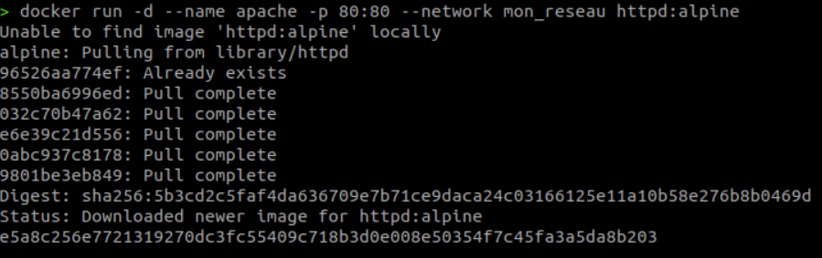
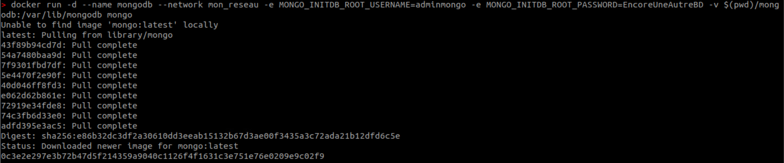
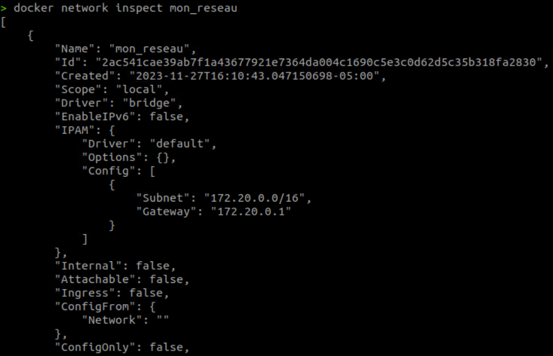
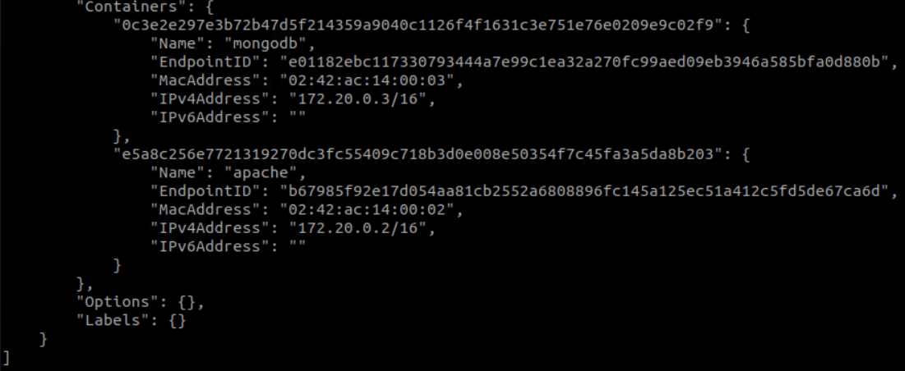
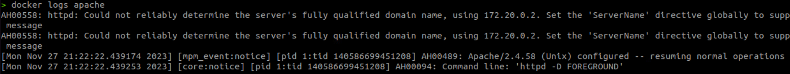

# Travail pratique 2 - 420-W45-SF 

**Date:** _11-27-2023_  **Réalisé par:** Gabriel Morissette

## Contexte
Installation d'un système de conteneur et configuration sécuritaire 

Objectifs :

- Installation d'un système de conteneur en respectant la procédure et les recommandations du manufacturier au besoin;
- Configurer le système de conteneurs en fonction d’une utilisation sécuritaire;
- Vérifier que les éléments installés fonctionnent comme prévu;
- Configurer des règles de gestions des accès sécuritaires.

# Vérifications demandées

## Vérification de l'installation de Docker et Docker Compose
 

# Section 1 - Étape 2

## Commandes de création
### Création du réseau
 

### Création conteneur Apache
 

### Création conteneur MongoDB
 

## Vérifications
### Vérification des conteneurs sur mon_reseau
 
 

### Journaux apache
 
