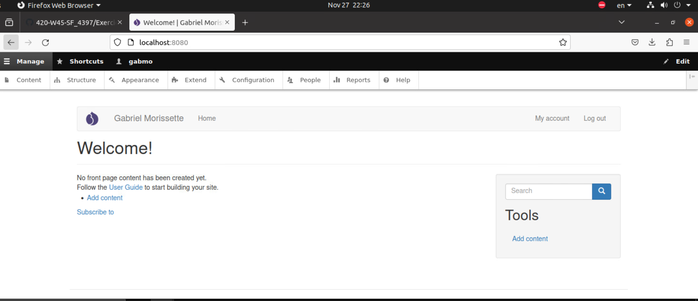

# Section 2 : Construction personnalisée d'une image

**Date:** _11-27-2023_  **Réalisé par:** Gabriel Morissette

## Contexte
 - Construction personnalisée d'une image pour Drupal 
- Installation du thème bootstrap

## Vérification demandée
Capture d'écran démontrant la configuration et le thème changés:  
 